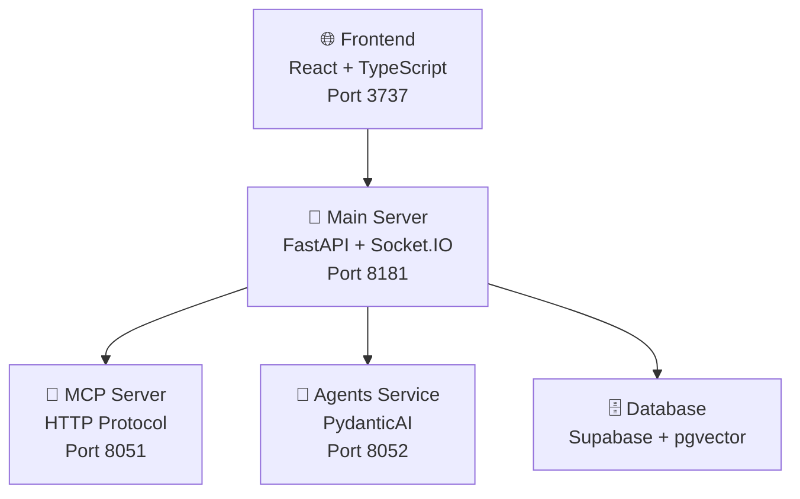

# 🚀 CLAUDE.md - Developer Guide

> **Archon V2 Alpha Development Guidelines**  
> *Building the future of knowledge management with AI*

---

## 🎯 Alpha Development Philosophy

### 🏗️ **Local-First Deployment**
Each developer runs their own instance - no shared environments, no deployment headaches.

### 💡 **Core Principles**

| Principle | Description | Why It Matters |
|-----------|-------------|----------------|
| 🚫 **No Backwards Compatibility** | Remove deprecated code immediately | Faster iteration, cleaner codebase |
| 🔍 **Detailed Errors Over Grace** | Expose problems, don't hide them | Quick issue identification and fixes |
| ⚡ **Break Things to Improve** | Alpha is for rapid experimentation | Innovation over stability |

---

## 🛠️ Error Handling Strategy

> **Golden Rule**: Smart failures - crash when it matters, continue when it doesn't.

### 💥 **When to FAIL FAST** *(Let it crash!)*

```python
# ❌ These should STOP everything immediately
- Service startup failures
- Missing configuration  
- Database connection issues
- Authentication/authorization errors
- Data corruption or validation failures
- Critical dependencies unavailable
- Invalid data that would corrupt state
```

### ✅ **When to CONTINUE** *(But log everything)*

```python
# ⚠️ These should complete but track failures
- Batch processing operations
- Background tasks (embeddings, async jobs)
- WebSocket events
- Optional features
- External API calls (with retry logic)
```

### 🚨 **Critical Rule: NEVER Accept Corrupted Data**

#### ❌ **WRONG - Silent Corruption**
```python
try:
    embedding = create_embedding(text)
except Exception as e:
    embedding = [0.0] * 1536  # 💀 CORRUPTS DATABASE!
    store_document(doc, embedding)
```

#### ✅ **CORRECT - Skip Failed Items**
```python
try:
    embedding = create_embedding(text)
    store_document(doc, embedding)  # Only store on success
except Exception as e:
    failed_items.append({'doc': doc, 'error': str(e)})
    logger.error(f"⚠️ Skipping document {doc.id}: {e}")
    # Continue with next document, don't store anything
```

#### 🎯 **BEST PRACTICE - Batch Processing**
```python
def process_batch(items):
    results = {'succeeded': [], 'failed': []}
    
    for item in items:
        try:
            result = process_item(item)
            results['succeeded'].append(result)
        except Exception as e:
            results['failed'].append({
                'item': item,
                'error': str(e),
                'traceback': traceback.format_exc()
            })
            logger.error(f"❌ Failed to process {item.id}: {e}")
    
    return results  # Always return both successes and failures
```

---

## 🏛️ Architecture Overview



### 📦 **Service Breakdown**

| Service | Technology | Port | Purpose |
|---------|------------|------|---------|
| **Frontend** | React + TypeScript + Vite + Tailwind | 3737 | User interface and experience |
| **Main Server** | FastAPI + Socket.IO | 8181 | API endpoints and real-time updates |
| **MCP Server** | HTTP-based MCP protocol | 8051 | Model Context Protocol integration |
| **Agents Service** | PydanticAI | 8052 | AI/ML operations and agents |
| **Database** | Supabase (PostgreSQL + pgvector) | - | Data storage and vector search |

---

## ⚡ Development Commands

### 🎨 **Frontend Commands** *(archon-ui-main/)*

```bash
# 🚀 Development
npm run dev              # Start dev server (port 3737)
npm run build            # Production build
npm run preview          # Preview production build

# 🔍 Quality Assurance  
npm run lint             # ESLint checks
npm run test             # Run Vitest tests
npm run test:coverage    # Coverage report
npm run test:ui          # Interactive test UI
```

### 🐍 **Backend Commands** *(python/)*

```bash
# 📦 Package Management (using uv)
uv sync                  # Install/update dependencies
uv add package-name      # Add new dependency
uv remove package-name   # Remove dependency

# 🏃 Running Services
uv run python -m src.server.main     # Run server locally
uv run pytest                        # Run all tests
uv run pytest tests/test_api_essentials.py -v  # Specific tests

# 🐳 Docker Operations
docker-compose up --build -d         # Start all services
docker-compose logs -f               # View real-time logs
docker-compose restart               # Restart services
docker-compose down                  # Stop all services
```

---

## 📡 API Endpoints Reference

### 🧠 **Knowledge Base**
```http
POST /api/knowledge/crawl      # 🕷️ Crawl a website
POST /api/knowledge/upload     # 📄 Upload documents (PDF, DOCX, MD)
GET  /api/knowledge/items      # 📋 List knowledge items
POST /api/knowledge/search     # 🔍 RAG search
```

### 🔌 **MCP Integration**
```http
GET  /api/mcp/health           # ❤️ MCP server status
POST /api/mcp/tools/{tool}     # 🛠️ Execute MCP tool
GET  /api/mcp/tools            # 📝 List available tools
```

### 📊 **Projects & Tasks** *(Optional)*
```http
GET  /api/projects             # 📋 List projects
POST /api/projects             # ➕ Create project
GET  /api/projects/{id}/tasks  # 📝 Get project tasks  
POST /api/projects/{id}/tasks  # ✨ Create task
```

---

## 🔄 Real-Time Events (Socket.IO)

| Event | Purpose | Data |
|-------|---------|------|
| `crawl_progress` | 🕷️ Website crawling updates | Progress percentage, current URL |
| `project_creation_progress` | 📊 Project setup status | Setup steps, completion status |
| `task_update` | ✅ Task status changes | Task ID, new status, metadata |
| `knowledge_update` | 🧠 Knowledge base changes | Added/updated items, source info |

---

## 🌍 Environment Configuration

### ✅ **Required Variables**
```bash
# 🗄️ Database Connection
SUPABASE_URL=https://your-project.supabase.co
SUPABASE_SERVICE_KEY=your-service-key-here
```

### ⚙️ **Optional Variables**
```bash
# 🤖 AI Integration
OPENAI_API_KEY=your-openai-key        # Can be set via UI

# 📊 Monitoring & Logging
LOGFIRE_TOKEN=your-logfire-token      # Observability platform
LOG_LEVEL=INFO                        # DEBUG, INFO, WARNING, ERROR

# 🔧 Development
NODE_ENV=development                  # Frontend environment
PYTHON_ENV=development                # Backend environment
```

---

## 📁 Project Structure

### 🎨 **Frontend Structure**
```
archon-ui-main/
├── 🧩 src/components/     # Reusable UI components
├── 📄 src/pages/          # Main application pages  
├── 🔧 src/services/       # API communication
├── 🪝 src/hooks/          # Custom React hooks
├── 🎯 src/contexts/       # React context providers
├── 🎨 src/styles/         # CSS and styling
└── ⚡ src/utils/          # Helper functions
```

### 🐍 **Backend Structure**
```
python/
├── 🚀 src/server/         # Main FastAPI application
├── 📡 src/server/api_routes/  # API route handlers
├── 🏗️ src/server/services/   # Business logic services
├── 🔌 src/mcp/            # MCP server implementation
├── 🤖 src/agents/         # PydanticAI agent implementations
├── 🗄️ src/database/       # Database models and migrations
└── 🧪 tests/              # Test suites
```

---

## 🗄️ Database Schema

### 📊 **Key Tables**

| Table | Purpose | Key Fields |
|-------|---------|------------|
| `sources` | 🌐 Crawled websites & uploads | url, type, status, metadata |
| `documents` | 📄 Processed chunks + embeddings | content, embedding, source_id |
| `projects` | 📊 Project management | name, description, status |
| `tasks` | ✅ Task tracking | title, status, project_id, assignee |
| `code_examples` | 💻 Extracted code snippets | language, code, description |

---

## 🚀 Common Development Workflows

### ➕ **Adding a New API Endpoint**

1. **📝 Create Route Handler**
   ```python
   # python/src/server/api_routes/new_feature.py
   from fastapi import APIRouter
   
   router = APIRouter()
   
   @router.get("/new-endpoint")
   async def new_endpoint():
       return {"message": "Hello World"}
   ```

2. **🏗️ Add Service Logic**
   ```python
   # python/src/server/services/new_service.py
   class NewService:
       async def process_data(self, data):
           # Business logic here
           return processed_data
   ```

3. **🔗 Register Router**
   ```python
   # python/src/server/main.py
   from api_routes.new_feature import router as new_router
   app.include_router(new_router, prefix="/api")
   ```

4. **🎨 Update Frontend Service**
   ```typescript
   // archon-ui-main/src/services/newService.ts
   export const callNewEndpoint = async () => {
     const response = await api.get('/new-endpoint');
     return response.data;
   };
   ```

### 🎨 **Adding a New UI Component**

1. **🧩 Create Component**
   ```tsx
   // archon-ui-main/src/components/NewComponent.tsx
   export const NewComponent = () => {
     return <div>New Component</div>;
   };
   ```

2. **📄 Add to Page**
   ```tsx
   // archon-ui-main/src/pages/HomePage.tsx
   import { NewComponent } from '../components/NewComponent';
   ```

3. **🧪 Add Tests**
   ```typescript
   // archon-ui-main/test/components/NewComponent.test.tsx
   import { render } from '@testing-library/react';
   import { NewComponent } from '../../src/components/NewComponent';
   ```

---

## 🔧 Debugging & Troubleshooting

### 🔌 **MCP Connection Issues**

```bash
# 1. Check MCP Health
curl http://localhost:8051/health

# 2. View MCP Logs
docker-compose logs archon-mcp

# 3. Test Tool Execution
# Use the MCP page in the UI

# 4. Verify Database Connection
# Check Supabase credentials in .env
```

### 📊 **Common Debug Commands**

```bash
# 🐍 Backend Debugging
uv run python -c "import src.server.main; print('Backend OK')"
uv run pytest tests/ -v --tb=short

# 🎨 Frontend Debugging  
npm run lint -- --fix
npm run test -- --reporter=verbose

# 🐳 Docker Debugging
docker-compose ps                    # Check service status
docker-compose logs --tail=50        # Recent logs
docker system prune                  # Clean up resources
```

---

## ⚡ Code Quality Standards

### 🐍 **Python Standards**
- **Python 3.12** with 120 character line length
- **Ruff** for linting - errors, warnings, unused imports
- **Mypy** for type checking - ensures type safety
- **Auto-formatting** on save in IDEs

```bash
# 🔍 Quality Checks
uv run ruff check                    # Linting
uv run ruff check --fix              # Auto-fix issues  
uv run mypy src/                     # Type checking
```

### 🎨 **Frontend Standards**
- **TypeScript** strict mode enabled
- **ESLint** with React hooks rules
- **Prettier** for consistent formatting
- **Vitest** for unit testing

```bash
# 🔍 Quality Checks
npm run lint                         # ESLint check
npm run lint -- --fix               # Auto-fix issues
npm run type-check                   # TypeScript check
```

---

## 🛠️ Available MCP Tools

> **When connected to Cursor/Windsurf IDE**

| Tool | Purpose | Usage |
|------|---------|-------|
| `archon:perform_rag_query` | 🔍 Search knowledge base | Find relevant documents and content |
| `archon:search_code_examples` | 💻 Find code snippets | Locate specific code patterns |
| `archon:manage_project` | 📊 Project operations | Create, update, delete projects |
| `archon:manage_task` | ✅ Task management | Handle task lifecycle |
| `archon:get_available_sources` | 📋 List knowledge sources | See what's in the knowledge base |

---

## ⚠️ Important Notes & Tips

### 💡 **Key Features**
- ✅ **Projects feature is optional** - toggle in Settings UI
- ✅ **All services use HTTP** - no gRPC complexity
- ✅ **Socket.IO handles real-time** - seamless live updates
- ✅ **Vite proxy for development** - no CORS issues
- ✅ **UV for Python deps** - fast, reliable package management
- ✅ **Docker Compose orchestration** - one command to rule them all

### 🚀 **Quick Start Checklist**
1. ✅ Clone repository
2. ✅ Set up `.env` file with Supabase credentials
3. ✅ Run `docker-compose up --build -d`
4. ✅ Navigate to `http://localhost:3737`
5. ✅ Configure OpenAI API key in Settings
6. ✅ Start building amazing features!

---

## 📞 Getting Help

### 🔗 **Useful Links**
- 📚 **Documentation**: Check inline code comments
- 🐳 **Docker Issues**: `docker-compose logs [service-name]`
- 🗄️ **Database Issues**: Check Supabase dashboard
- 🔌 **MCP Issues**: Test via `/api/mcp/health` endpoint

### 🆘 **Emergency Commands**
```bash
# 🔥 Nuclear option - reset everything
docker-compose down --volumes --remove-orphans
docker-compose up --build -d

# 🧹 Clean slate - remove all containers and images  
docker system prune -a --volumes
```

---

*Happy coding! 🚀 Build something amazing with Archon V2 Alpha!*
